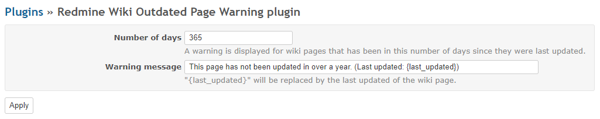
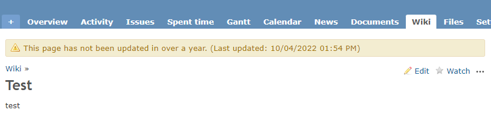

# Redmine wiki outdated page warning plugin

It is a plugin of [Redmine](http://www.redmine.org) that displays warning on outdated wiki pages.

## Installation

Clone this repository to the Redmine plugin directory.  

```
cd {RAILS_ROOT}/plugins
git clone https://github.com/onozaty/redmine_wiki_outdated_page_warning.git
```

## Usage

From the plugin's configuration screen, configure the settings for warnings.



In the "Number of days", enter the number of days you judge to be old.  
A warning is displayed for wiki pages that has been in this number of days since they were last updated.

In the "Warning message", enter the content of the warning message.  
`{last_updated}` will be replaced by the last updated of the wiki page.




## Supported versions

Redmine 3.0.x - 3.4.x, 4.0.x or later

## License

The plugin is available under the terms of the [GNU General Public License](http://www.gnu.org/licenses/gpl-2.0.html), version 2 or later.

## Author

[onozaty](https://github.com/onozaty)
